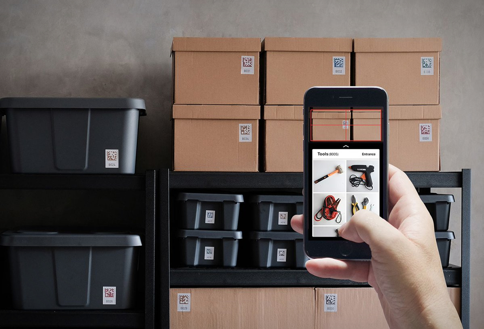
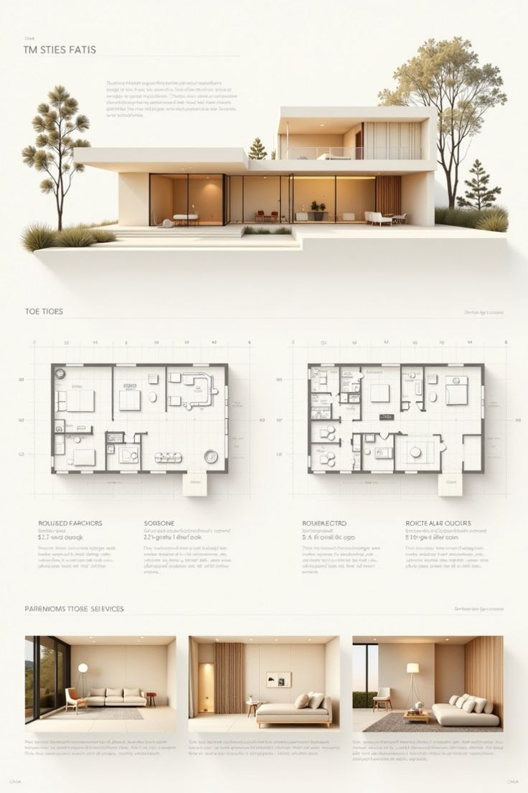

# thing

## Thing

### Introduction

[https://github.com/vietphan1995/thing.git](https://github.com/vietphan1995/thing.git)

[Send to email: vietphan95@outlook.com](mailto:vietphan95@outlook.com?subject=register_idea:thing_project&body=left_your_idea)

**Thing** is a software helps manage your thing in-house by **renting** tag/label which keep static qr code or barcode for thing address accessing.

**Thing lock** is a digital lock hardware designed for this software with Thing tag/label default and light, sound function for raise activities like lock, unlock, warning.

.
### [back to git projects …](https://github.com/vietphan1995/projects)

### Notes
https://phantrungviet.notion.site/thing-2f75e832d6ee80a99575c8daee1ff0e9